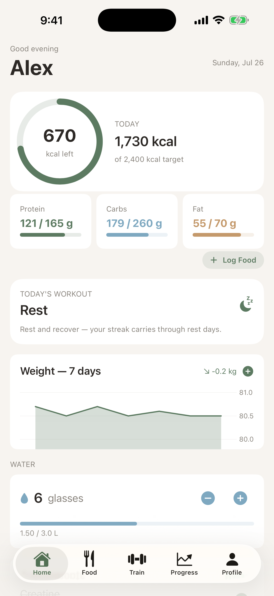
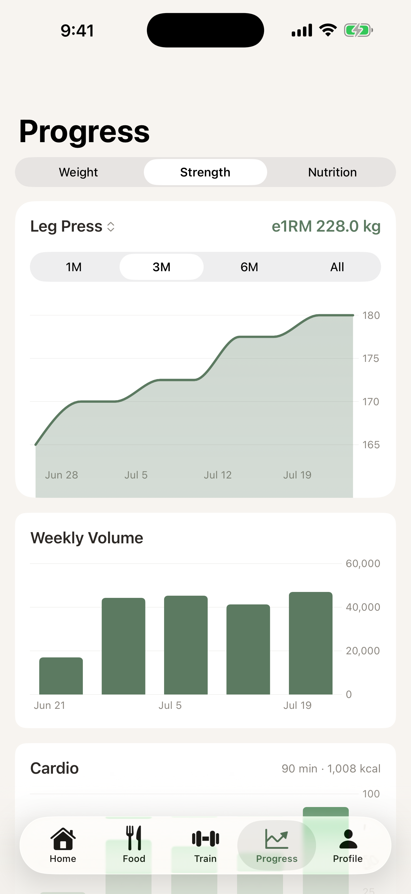
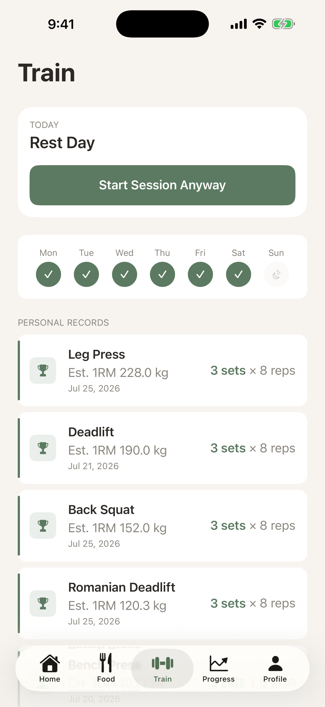
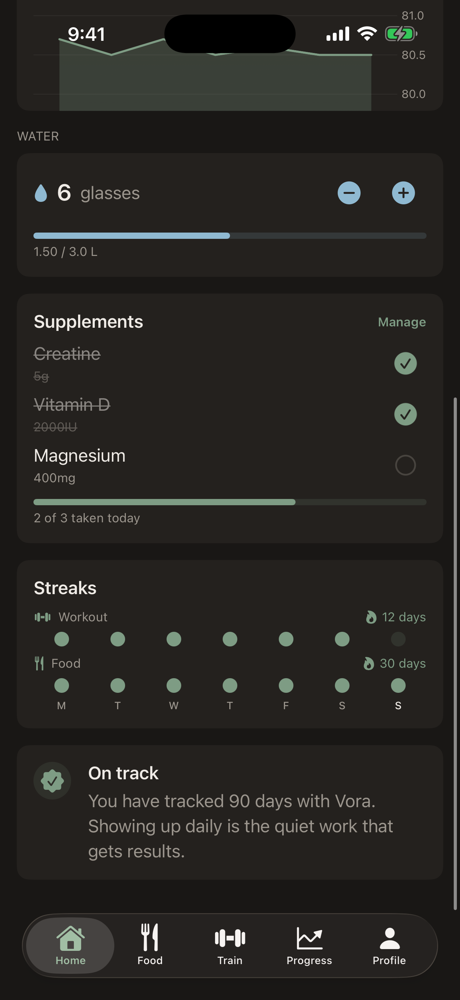

# Vora

**Track. Train. Transform.**

Vora is a premium iOS fitness tracking app that brings nutrition, training, and body progress together in one place. Log meals in seconds with OpenFoodFacts search and barcode scanning, track workouts around your training split, watch your weight trend over time, and let science-based calorie and macro targets — computed from your own stats and goal — guide every day. Built natively with SwiftUI and SwiftData for a fast, offline-first experience.


## Features

### Nutrition
- Daily food diary with five meal slots (Breakfast, Post-Workout, Lunch, Dinner, Snacks)
- Calorie ring with remaining counter and animated macro progress bars
- Food search powered by OpenFoodFacts with debounced async results
- Barcode scanner (EAN-13/8, UPC-E, Code 128) with manual-entry fallback
- Food detail with full nutrition panel and live macro recalculation at any serving size
- Custom food creator with per-100 g macro control
- Recent foods for under-5-second re-logging
- Water tracking with glass counter and litre progress toward a daily target
- Nutrient breakdown (fibre, sugar, sodium) and one-tap copy of the previous day
- Day-by-day navigation with swipe or arrows

### Workout
- Session logging built around your training split (Upper/Lower, Push Pull Legs, Full Body, Custom)
- Exercise and set tracking: weight, reps, RPE, completion
- Session volume and duration tracking
- Per-day exercise templates with previous-session weight auto-fill
- Personal records with per-exercise history and progression charts
- Cardio logging across 10 machine types with MET-based calorie estimates

### Progress
- Weight logging with trend visualization and goal projection
- Body fat percentage and body measurement tracking
- Strength and nutrition analytics with Swift Charts
- Workout, food, and supplement streaks
- Daily insight engine across nutrition, training, and supplements

### Profile
- Guided onboarding: units, biological sex, height, weight, goal, activity level, training split
- Science-based calorie and macro suggestions (Mifflin-St Jeor), fully editable
- Inline profile editing with unit-aware inputs (metric / imperial)
- HealthKit integration: weight, active energy, steps, and workouts (fully optional)

## Build Progress

| Phase | Scope | Status |
|-------|-------|--------|
| 0 | Foundation — project structure, design system, data models, tab shell | ✅ Complete |
| 1 | Onboarding & Profile | ✅ Complete |
| 2 | Nutrition Module — diary, search, barcode, water | ✅ Complete |
| 3 | Workout Module | ✅ Complete |
| 4 | Progress & Analytics | ✅ Complete |
| 5 | Polish, Testing & Launch | ✅ Complete |

## Improvements

Ten post-launch improvements shipped since the Phase 0–5 build:

1. **Workout history** — tappable sessions with full detail view (exercises, sets, weights, reps per session)
2. **Personal records** — premium cards showing sets × rep range, exercise history drill-down with Swift Charts progression chart
3. **Exercise templates** — built-in exercises per split day with drag reorder, swipe delete, and previous session weight auto-fill
4. **Cardio logging** — 10 machine types (Treadmill, Stair Climber, Elliptical, Stationary Bike, Rowing Machine, Running, Cycling, Walking, Swim, Other) with machine-specific inputs and precise MET calorie calculation
5. **Food tabs** — My Foods, Recipes, and Meals tabs with real SwiftData content, recipe builder, meal templates with one-tap relog
6. **Progress analytics** — Weight | Strength | Nutrition segments with Swift Charts, exercise picker, range selector, calorie and protein trends
7. **Smart reminders** — configurable meal, water, and workout reminders with smart skip logic (only fires if condition not met)
8. **Body measurements** — guided logging with how-to instructions per measurement, history, waist trend chart, body fat % tracking
9. **Home shortcuts** — quick-log food button (time-aware meal slot), weight shortcut, food logging streak alongside workout streak, barcode scanner offline handling with retry and fallback
10. **Supplement tracker** — daily checklist with circular checkboxes, quick-add common supplements, timing groups, per-supplement reminders, consistency streak on Progress

## Tech Stack

- **SwiftUI** — fully native UI with a custom design system (typography, adaptive colors, spacing tokens)
- **SwiftData** — offline-first persistence across 17 models: `UserProfile`, `FoodEntry`, `CustomFood`, `WorkoutSession`, `ExerciseLog`, `SetEntry`, `WeightEntry`, `BodyMeasurement`, `WaterEntry`, `CardioEntry`, `SplitDay`, `SavedMeal`, `SavedMealItem`, `Recipe`, `RecipeIngredient`, `Supplement`, `SupplementLog`
- **Swift Charts** — weight, strength progression, and nutrition trend charts
- **HealthKit** — optional weight, active energy, steps, and workout sync
- **UserNotifications** — one-shot smart reminders recomputed on every app activation

## Screenshots

| Home | Progress | Train | Dark Mode |
|------|----------|-------|-----------|
|  |  |  |  |

## Getting Started

### Requirements
- Xcode 16 or later
- iOS 17+ simulator or device

### Run locally
1. Clone the repository:
   ```bash
   git clone https://github.com/MajdArow123/Vora.git
   cd Vora
   ```
2. Open `Vora.xcodeproj` in Xcode.
3. Select the **Vora** scheme and an iOS 17+ simulator (or your device).
4. Build and run (`⌘R`).

No API keys or configuration are required — food search uses the public [OpenFoodFacts](https://world.openfoodfacts.org) API. HealthKit and camera (barcode) permissions are requested in-app and the app is fully functional if declined. Barcode scanning via camera requires a physical device; the simulator falls back to manual barcode entry.
